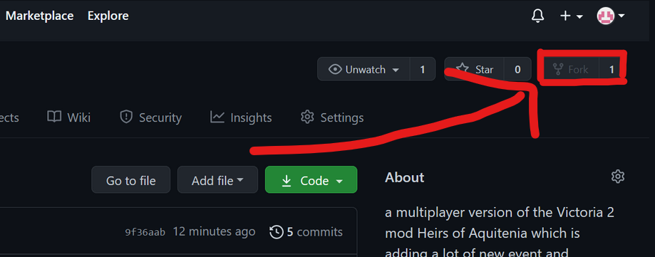
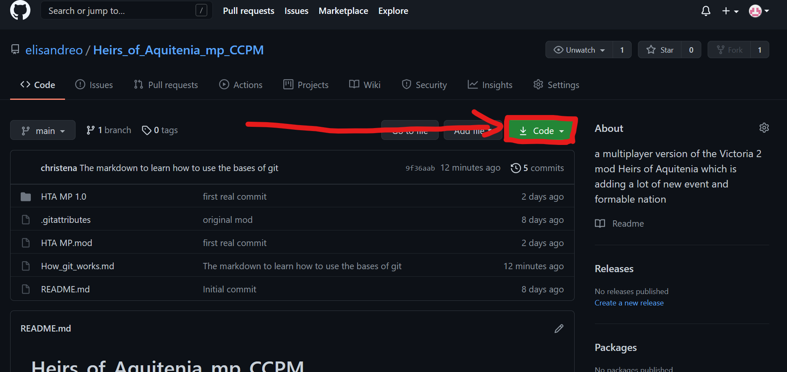
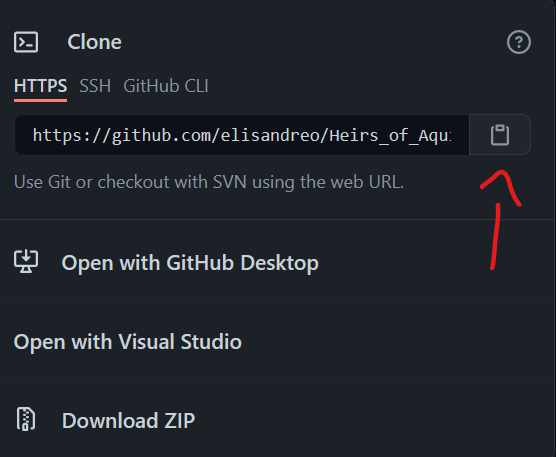
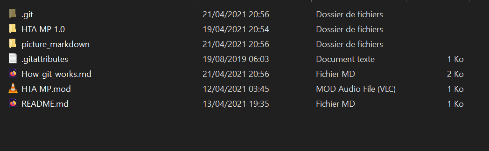
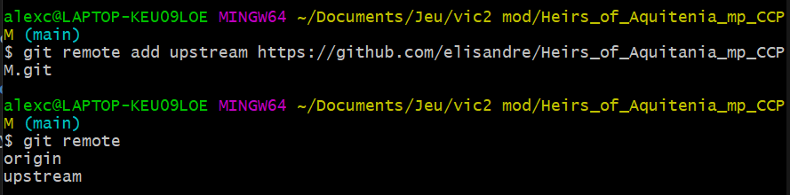
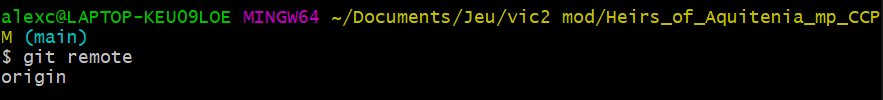

# A quick introduction on git : 


## What you need to know and download before the turorial :

Git is an online software of decentralized version management. It's often used in for IT project as it manage merging files and common project very well. It also keep the old version in case u mess with your project.

So, to begin, you are going to need a github account :

<a href="http://github.com/" target="_blank">Github main page</a>

You will also need to install a git console based on linux to save your work online and download the new versions that others work on : 

<a href="https://git-scm.com/download/win" target="_blank">The Consol</a>


So, now that you have created your git account and downloaded the console, we can begin the real tutorial.

## How to download my files :

Once you're on Github, go to my project (<a href="https://github.com/elisandreo/Heirs_of_Aquitenia_mp_CCPM" target="_blank">Heirs_of_Aquitania_CCPM</a>) and click on fork : 



**So what does the fork do ?**
It will create for you new git repository based on the one you just forked. It will give me acces to your reposiroty and give you the possibility later on to do merge request on my repository.

Now you will click on the button **Clone** and copy the HTTPS link

 

Then you open your git console, go to the directory in which you want to work for this project and type : 
```sh
git clone "the link you just copied"
```
(don't write the ", and if you can't paste, just write the link somewhere you can read it from and then write it)

It gives that : 


then press the enter key.

Now you have all the files that are on my git repository. It should look like that : 



(obviously not in french for you)

## How to upload and download next time :

First you should add my repository as a remote. But what is a remote ?

Using your git console, type :

```sh
git remote
```

 

Here, origin is my remote, it's the git repository where I'm sending my modification and the one I'm downloading the modification from. To add me as a remote you should type this : 

```sh
git remote add "the name you want to give" "the link of my repository + .git"
```
 

(Here you can notice I added mine so it's the same as my origin but for you it's different)

If you want to remove a remote, just type 

```sh
git remote remove "name of the remote you want to remove"
```

 
