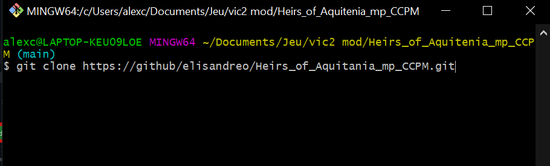
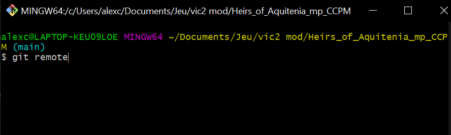
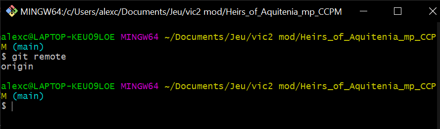
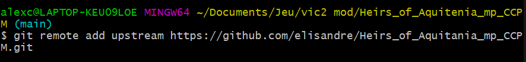
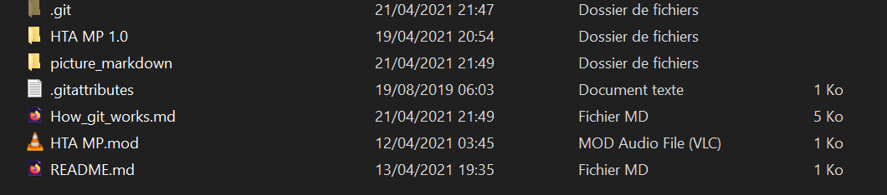
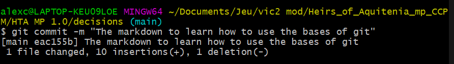
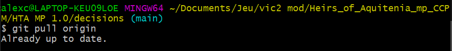

# A quick introduction on git : 


## What you need to know and download before the turorial :

Git is an online software of decentralized version management. It's often used in for IT project as it manage merging files and common project very well. It also keep the old version in case u mess with your project.

So, to begin, you are going to need a github account :

<a href="http://github.com/" target="_blank">Github main page</a>

You will also need to install a git console based on linux to save your work online and download the new versions that others work on : 

<a href="https://git-scm.com/download/win" target="_blank">The Consol</a>


So, now that you have created your git account and downloaded the console, we can begin the real tutorial.

## How to download my files :

Once you're on Github, go to my project (<a href="https://github.com/elisandreo/Heirs_of_Aquitenia_mp_CCPM" target="_blank">Heirs_of_Aquitania_CCPM</a>) and click on fork : 


**So what does the fork do ?**
It will create for you new git repository based on the one you just forked. It will give me acces to your reposiroty and give you the possibility later on to do merge request on my repository.

Now you will click on the button **Clone** and copy the HTTPS link

 

Then you open your git console, go to the directory in which you want to work for this project and type : 
```sh
git clone "the link you just copied"
```
(don't write the ", and if you can't paste, just write the link somewhere you can read it from and then write it)

It gives that : 



then press the enter key.

Now you have all the files that are on my git repository. It should look like that : 


(obviously not in french for you)

## How to upload and download next time :

First you should add my repository as a remote. But what is a remote ?

Using your git console, type :

```sh
git remote
```

 

Here, origin is my remote, it's the git repository where I'm sending my modification and the one I'm downloading the modification from. To add me as a remote you should type this : 

```sh
git remote add "the name you want to give" "https://github.com/elisandreo/Heirs_of_Aquitenia_mp_CCPM.git"
```
 

(Here you can notice I added mine so it's the same as my origin but for you it's different)

If you want to remove a remote, just type 

```sh
git remote remove "name of the remote you want to remove"
```

 


### How to upload

So in order to upload, you need to first add the files you modified. You have multiple option to do it depending on where are the files in your local reposiroty : 

```sh
git add "name of file" #if the file is at the same level of folder than your git console

git add "folder/name of file" #it look for you files directly where it is

git add --all #add all the files you modified. Dangerous if you didn't want one file to be uploaded
```

So, to be clear : 


This works because How_git_works is at the same level as my git console : 

 

Now I couldn't add the france.txt file for example : 


But if I go to the file folder it works : 

 


Now that you added the files you modified, you will need to register them into your local repository with the commit command

```sh
git commit 
```

But if you do that another screen is going to open to ask you for a commentary and quitting it is not that easy. So instead, do : 

```sh
git commit -m"The commentary about what you modified"
```

(The commentary need to be short, just say what you worked on)




Finally, you will need to **push** to your distant repository : 

```sh
git push "the remote you want to push your modification to"
```

Like that : 

 

(The message following isn't important, it just says the files size and other stuff)


You must **ALWAYS** push to your origin remote (or another name if you changed it). So in order to push the modification to my git reposiroty (the master of the project), you will need to do a merge request on git, follow this  <a href="https://docs.github.com/en/github/collaborating-with-issues-and-pull-requests/merging-a-pull-request" target="_blank">guide</a>


I will need to accept it and only then your modification will be added to the master project 


### How to download now ?

In order to download the modification made by other users, you will need to **pull** from my repository, using the remote you added (remember ?). So you just need to do that : 

```sh
git pull "the name you gave to the remote" master #the master is optional but I learned with it 
```

 


Now the guide is over, I hope you understood it and that it wasn't hard !

A quick link to recap some useful git console commands <a href="https://github.com/elisandreo/Heirs_of_Aquitenia_mp_CCPM/blob/main/useful_git_console_commands.md" target="_blank">here.</a>